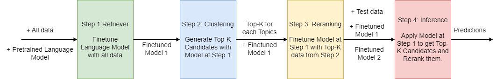

# Kaggle-Learning-Equality---Curriculum-Recommendations

[link](https://www.kaggle.com/competitions/learning-equality-curriculum-recommendations)

# Task
多言語の教育内容のカリキュラムを特定のトピックと一致させる。 [link](https://www.youtube.com/watch?v=6tq3tGihQhY)

 

### 評価関数
F2 score

 

## Models
- stsb-xlm-r-multilingual (First Stage)

- paraphrase-multilingual-mpnet-base-v2 (Second Stage)

 

## Main methods that worked

- First Stage
  - step1 : Finetuning Language Model
    - epoch : 20
    - batch_size : 64
    - MultipleNegativesRankingLoss
  - step2 : Clustering Unsupervised train set
    - K-Top : 50
- Second Stage
   - step3 : ReRanking
   - step4 : Inference
   
 

 

## Final Result

103 / 1057 位  🥉

CV : 0.6107

Public LB : 0.54146

Private LB : 0.55678

 
 

## Efficiency Prize

## Work

- First Stage のクラスタリングまでの状態で提出
  - model : all-MiniLM-L6-v2
  - K-Top : 5
 
## Result

21 位

CV : 0.3458

Private LB : 0.33418

Scoring Time : 	2391

EfficiencyScore : -0.363328

